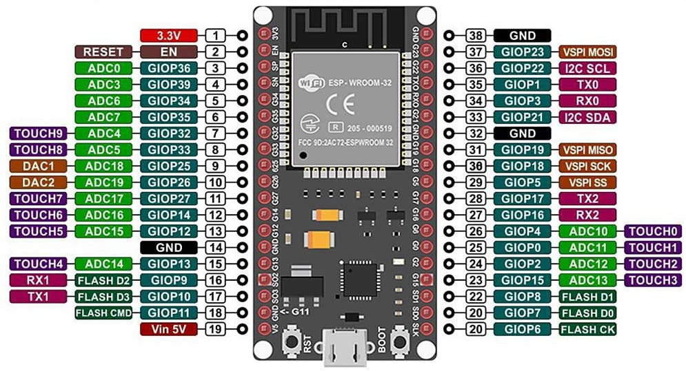

# ble_esp32
This repository consists of BLE(bluetooth low energy) projects for Esp32 microcontroller.

## ESP32-Desciption

ESP32 is a single 2.4 GHz Wi-Fi-and-Bluetooth SoC (System On a Chip) designed by Espressif Systems.
The specific microcontroller used here is the DOIT ESP32 Devkit V1.

## Esp-32 Pin Layout

  

## Project I
Controlling a Servo motor using ESP32 BLE Feature
Code: sketch_jun01a.ino
<space>
GPIO PIN: S1 GPIO18 S2 GPIO19
Client can access host server using applications like nRF Connect or in this case we're using BLE Controller.
Commands: S1:(angle) S2:(angle) 
For Example: S1:90 S2:180 (sets the servo motor 1 to 90 degrees and servo motor 2 to 180 degrees)
